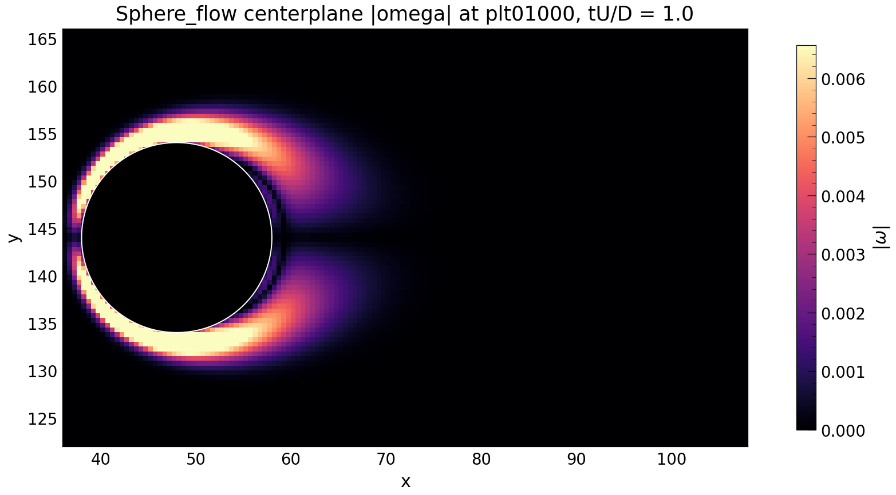
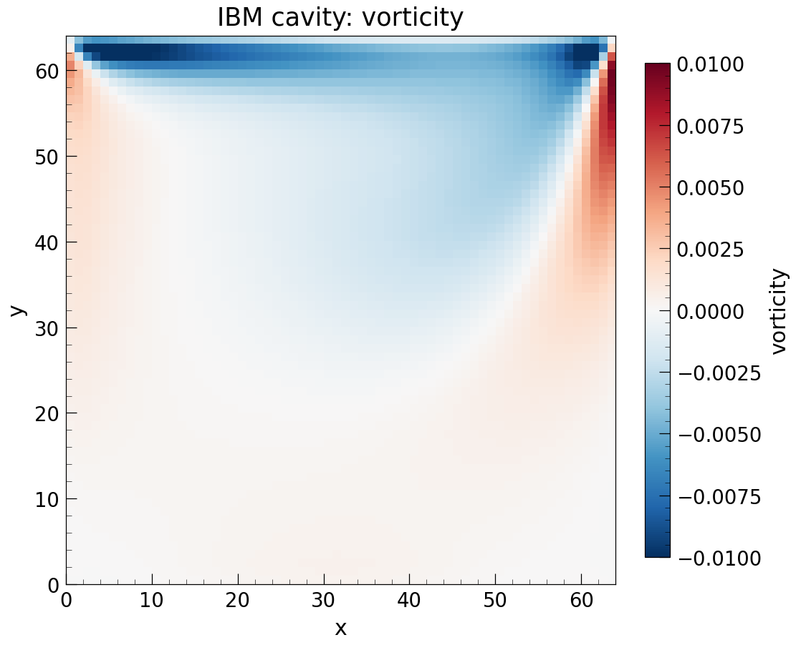
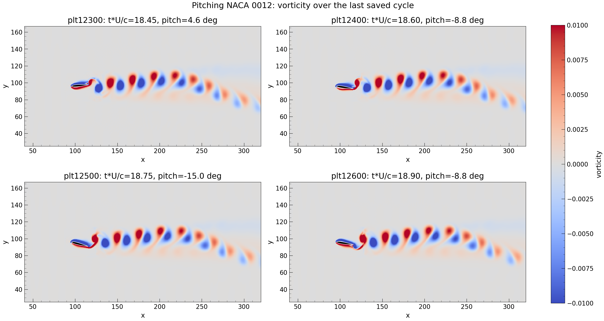

.. _Chap:Results:

Validation Cases
================

This section documents validation and example cases for the iLBMReX lattice
Boltzmann solver. The examples below demonstrate the solver's accuracy and
capabilities for incompressible flow simulation with immersed boundaries using
the direct-forcing immersed boundary method.

Cylinder Wake Flow (2D)
----------------------

Flow past a circular cylinder is a canonical validation case for incompressible
flow solvers. This case validates the acoustic properties and unsteady flow
structures captured by the lattice Boltzmann method.

**Problem Setup:**

- Cylinder diameter: :math:`D = 1`
- Computational domain: :math:`20D \times 10D` (2D)
- Reynolds number: Variable (e.g., Re = 100)
- Boundary conditions: Inlet/outlet in x-direction, periodic in y-direction
- Marker-based immersed boundary representation on finest AMR level

**Validation Metrics:**

- Drag coefficient :math:`C_D`
- Lift coefficient :math:`C_L`
- Strouhal number :math:`St = f \cdot D / U`

The solver accurately captures the vortex shedding frequency and force
coefficients across a range of Reynolds numbers using adaptive mesh refinement
around the cylinder. See ``Examples/Cylinder_flow`` for the input file and
visualizations.

Sphere Wake Flow (3D)
---------------------

Three-dimensional flow over a sphere extends the cylinder validation to 3D and
tests the robustness of the immersed boundary coupling in three spatial dimensions.

   Vorticity magnitude in the centerplane showing wake structure for flow over a
   sphere at moderate Reynolds number, computed using iLBMReX on adaptive mesh refinement.

**Problem Setup:**

- Sphere diameter: :math:`D = 1`
- Computational domain: :math:`20D \times 10D \times 10D`
- Reynolds number: Variable (e.g., Re = 100)
- Inlet velocity: :math:`U = 1` m/s
- Marker-based sphere representation on finest AMR level
- Three levels of AMR with finest resolution :math:`d/h = 16`

**Validation Metrics:**

- Drag coefficient :math:`C_D` compared to experimental correlations
- Accuracy with different AMR levels
- Q-criterion visualization for coherent structures

The flow past a sphere demonstrates that the direct-forcing immersed boundary
method accurately captures 3D flow physics with adaptive mesh refinement. The
solver resolves wake vortex dynamics and maintains coupling stability through
time-dependent regridding. See ``Examples/Sphere_flow`` for the input file.

Cavity Flow with Immersed Box (2D)
----------------------------------

Driven cavity flow with marker-IBM box forcing demonstrates immersed-boundary
coupling for internal flows in 2D.

   Vorticity magnitude showing primary and secondary recirculation zones in
   cavity flow with immersed boundary-represented interior structure.

**Problem Setup:**

- 2D cavity-style domain (with thin periodic z-extent in the input file)
- Lid motion imposed either by physical BC (``inputs_bc_ref``) or by marker box
  IBM (``inputs_ibm_box``)
- Marker geometry: axis-aligned box (``ibm.marker_geometry = box``)
- Reynolds number based on lid speed and cavity length (case-dependent)

**Validation Metrics:**

- Centerline velocity profiles (u and v components)
- Comparison with boundary-resolved non-IBM results
- Convergence with AMR refinement

This case demonstrates internal-flow IBM capability and consistency against a
boundary-condition reference case. See ``Examples/Cavity_flow`` for inputs and
comparison scripts.

Pitching NACA 0012 Airfoil (2D)
-------------------------------

Pitching airfoil motion demonstrates the solver's capability to handle
time-dependent moving boundaries with prescribed kinematics.

   Vorticity magnitude during one cycle of sinusoidal pitching motion showing
   dynamic stall phenomena captured by the iLBMReX solver.

**Problem Setup:**

- Airfoil: NACA 0012 with pitching motion
- Motion: Sinusoidal pitching :math:`\alpha(t) = \alpha_0 \sin(\omega t)`
- Mean angle of attack: :math:`\alpha_0 = 20°`
- Reduced frequency: :math:`k = \omega c / (2U_{\infty})`
- Reynolds number: Re = 1000

**Validation Metrics:**

- Lift and drag coefficients over pitch cycle
- Dynamic stall hysteresis
- Leading-edge vortex characteristics

The pitching airfoil case validates:

1. Dynamic boundary motion with prescribed kinematics
2. Proper force spreading and interpolation during unsteady motion
3. Stability of AMR regridding when tracking moving boundaries
4. Accuracy of aeroacoustic phenomena (vortex shedding)

The solver maintains markers on the finest AMR level throughout the pitch cycle
by tagging the swept region for refinement. See ``Examples/Pitching_airfoil``
for the input file and visualizations.

Couette Flow (2D)
-----------------

Couette flow between two parallel plates is a simple validation case for
verifying the no-slip boundary condition and linear velocity profile.

**Problem Setup:**

- Domain height: :math:`H = 1`
- Moving plate velocities: :math:`\pm U_0`
- Exact solution: Linear velocity profile :math:`u(y) = 2U_0(y - 0.5)`
- Reynolds number: Re = 100

**Validation Metrics:**

- L₂ error in velocity
- Second-order spatial accuracy
- Verification of boundary condition implementation

This analytic solution allows verification of the accuracy of the streaming step
and boundary condition implementation in the lattice Boltzmann method.

Taylor-Green Vortex Decay (2D)
------------------------------

The Taylor-Green vortex is a time-dependent, analytically defined velocity field
that decays due to viscosity. This case validates temporal accuracy and energy
dissipation properties.

**Problem Setup:**

- Domain: Periodic :math:`[0, 2\pi]^2`
- Initial velocity:

  .. math::

     u(x,y,0) = \sin(x)\cos(y)

     v(x,y,0) = -\cos(x)\sin(y)

- Kinematic viscosity: :math:`\nu = 0.01` m²/s
- Final time: :math:`t = 10`

**Validation Metrics:**

- Kinetic energy decay rate
- L₂ error norm over time
- Comparison with analytical decay :math:`E(t) = E_0 \exp(-2\nu t)`

The solver demonstrates correct dissipation of kinetic energy consistent with
the BGK collision operator and analytical predictions. This case validates:

1. Accuracy of viscous time integration
2. Energy conservation properties
3. Long-time stability at high Reynolds number

Example Problems
----------------

The iLBMReX repository includes example problems in the ``Examples/`` directory:

* ``Examples/Couette_flow`` - 2D Couette flow benchmark
* ``Examples/Cylinder_flow`` - 2D cylinder wake
* ``Examples/Cavity_flow`` - 2D driven cavity with immersed marker box
* ``Examples/Sphere_flow`` - 3D flow over a sphere
* ``Examples/SquareDuct_flow`` - 3D duct flow
* ``Examples/Pitching_airfoil`` - 2D pitching NACA 0012 airfoil

Each example directory contains:

- Input file(s) for problem parameters
- GNUmake build files
- Python visualization or validation scripts where applicable

All visualizations shown above are generated directly from iLBMReX simulation
outputs using the example input files. The results demonstrate the solver's
capability to accurately model canonical fluid dynamics problems with
moving immersed boundaries.
